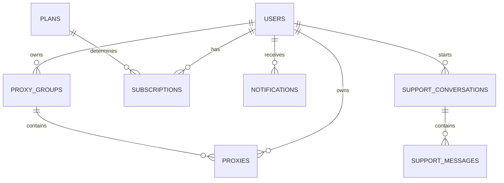

# ProxyM ERD

```mermaid
erDiagram
    USERS ||--o{ PROXIES : "owns"
    USERS ||--o{ PROXY_GROUPS : "owns"
    PROXY_GROUPS ||--o{ PROXIES : "contains"
    USERS ||--o{ SUBSCRIPTIONS : "has"
    PLANS ||--o{ SUBSCRIPTIONS : "determines"
    USERS ||--o{ NOTIFICATIONS : "receives"
    USERS ||--o{ SUPPORT_CONVERSATIONS : "starts"
    SUPPORT_CONVERSATIONS ||--o{ SUPPORT_MESSAGES : "contains"
```
